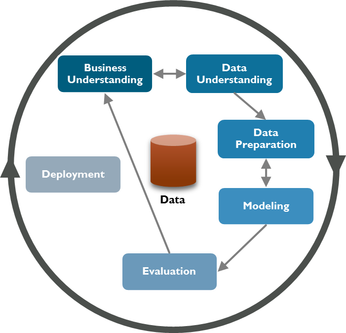
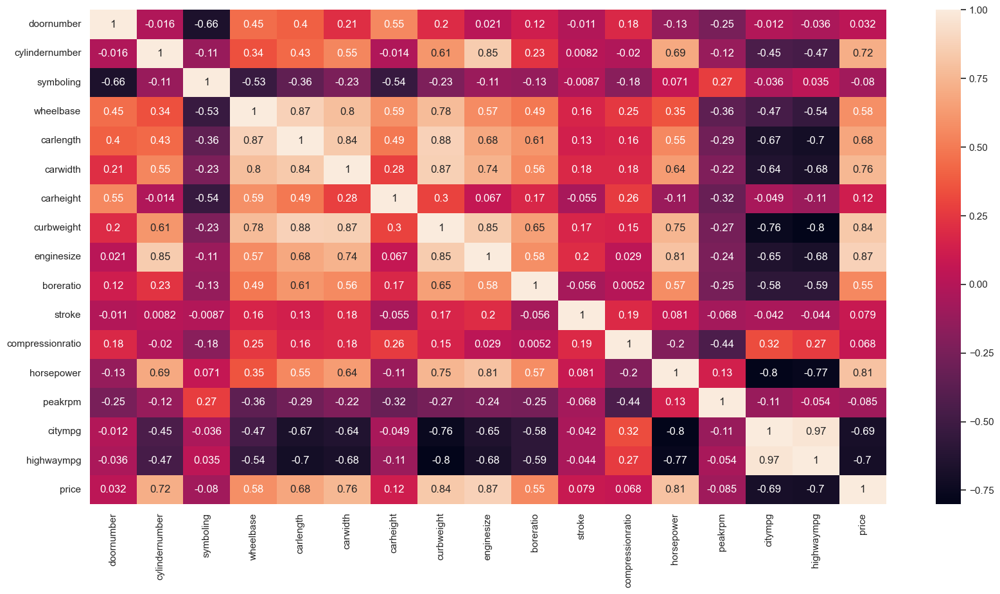
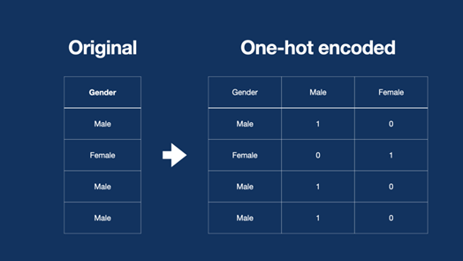
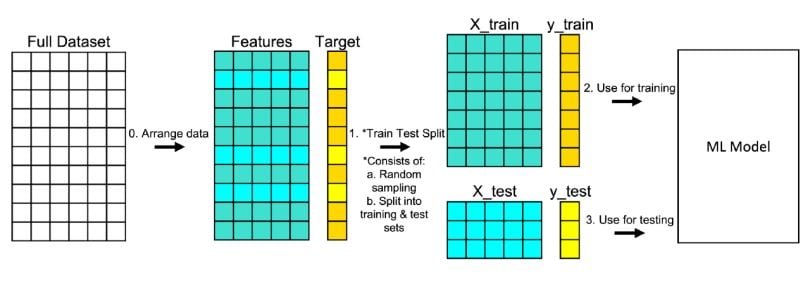

      

# Proyecto Integrador: Machine Learning en investigación de mercado automotor
Proyecto integrador del módulo 6 Machine Learning de la carrera de Data Science en soyHenry

A un equipo de estudiantes del último módulo de la carrera de Ciencia de Datos se le ha encomendado la tarea de crear un modelo que le permita a una computadora aprender a partir de los datos suministrados y realizar predicciones sin la necesidad de programación explícita. Al finalizar el proyecto, dicho equipo deberá haber podido poner en prácticas las habilidades adquiridas a lo largo del módulo de machine learning (ML).

## Planteamiento de la problemática
Hemos sido contratados en el equipo de ciencias de datos en una consultora de renombre. Nos han asignado a un proyecto de estudio de mercado de una importante automotriz china. Nuestro cliente desea ingresar a nuestro mercado de automóviles, por lo que nos han encomendado analizar las características de los vehículos presentes en el mercado actual. Dado que tienen en su catálogo una amplia colección de modelos de todo tipo, cuyo catálogo está estratificado en gamas según el gusto de cada región, desean saber **qué características presentan los vehículos de gama alta y los de gama baja en nuestro mercado**, para poder **abarcar a todo los públicos objetivos** ajustándose a toda la demanda y, en base a estos datos, poder cotizar correctamente los vehículos que ofrecerá.

Nuestro _Data Lead_ nos ha recomendado que analicemos detalladamente los datos, los preprocesemos debidamente y que diseñemos **dos modelos predictivos**, uno para el precio y otro para distinguir vehículos de gama alta y de gama baja, utilizando la mediana de los precios como punto de corte. Desean obtener los archivos con las predicciones en formato de texto plano.

Además del análisis detallado de la exploración de los datos, estas son las dos predicciones posibles que les interesaría analizar utilizando los datos que se han puesto a su disposición:
1. Implementar un modelo de clasificación con aprendizaje supervisado que permita clasificar el precio de los vehículos en baratos y caros usando la mediana de los precios como punto de corte.
2. Implementar un modelo de regresión con aprendizaje supervisado que permita predecir el precio final de los vehículos.

### CRISP-DM
La metodología Proceso Estándar de Toda la Industria para Minería de Datos ([CRISP-DM](https://www.ibm.com/docs/es/spss-modeler/saas?topic=dm-crisp-help-overview) en inglés) es utilizada en proyectos de análisis de datos y minería de datos. Se puede considerar como la metodología estándar en la industria para proyectos dedicados a extraer valor de los datos. Estaremos resumiendo sus fases dentro del proyecto en:

- [Fase 1: Análisis exploratorio de datos](#1-Exploremos-los-datos).
  - [Comprensión del negocio](#comprensión-del-negocio)
  - [Comprensión de los datos](#comprensión-de-los-datos)

- [Fase 2: Preparación de datos](#2-La-preparación-de-los-datos)
  - [El balance](#el-balance)
  - [De categóricas a numéricas](#de-categóricas-a-numéricas)
  - [La correlación entre las variables](#la-correlación-entre-las-variables)
  - [Nuevas columnas](#nuevas-columnas)
    - [One Hot Encoding](#one-hot-encoding)
  - [Entre datos de entrenamiento y dastos de prueba](#entre-datos-de-entrenamiento-y-dastos-de-prueba)
- [Fase 3: Modelación y evaluación](#3-Modelación-y-evaluación)
  - [Modelo KNN](#modelo-knn)
    - [Aspectos genereales de las pruebas KNN](#aspectos-genereales-de-las-pruebas-knn)
    - [Aspectos específicos para las pruebas KNN](#aspectos-específicos-para-las-pruebas-knn)
    - [Resultados obtenidos en las pruebas para el modelo de clasificación](#resultados-obtenidos-en-las-pruebas-para-el-modelo-de-clasificación)
    - [Resultados obtenidos en las pruebas para el modelo de regresión](#resultados-obtenidos-en-las-pruebas-para-el-modelo-de-regresión)
    - [Recomendaciones](#recomendaciones)
  - [Evaluación]()

La última fase de CRISP-DM, la de despliegue, queda fuera del alcance y objetivos del proyecto debido a que implementa el modelo en un entorno de producción y se realiza un seguimiento continuo para asegurar su correcto funcionamiento.

  

## 1 Exploremos los datos
### Comprensión del negocio
El mercado automotor está muy ligado a la cultura de cada país según los gustos de cada uno, por ejemplo:
- El mercado norteamericano valora mucho los motores y vehículos muy grandes.
- El mercado europeo prefiere el bajo consumo.
- El mercado latinoamericano, los precios finales bajos.

y así varía según la región, elpaís, el nivel socioeconómico o la cultura. 

Un mismo vehículo puede tener un valor muy distinto de un país al otro, y no solo por los impuestos o costos de producción, sino por cómo cotiza el modelo en el mercado.

### Comprensión de los datos

Para ello, nuestro departamento de datos ha recopilado precios y características de varios de los modelos de vehículos disponibles en nuestro mercado, junto con sus precios de venta al público. Y han armado el siguiente diccionario de datos:

Diccionario

<pre>
   NOMBRE DE LA VARIABLE   TIPO      DESCRIPCIÓN
   -----------------------------------------------------------------------------------------------
   car_ID                  Int       Número de Identificación del vehículo en la base de datos
   symboling               Int       Calificación de riesgo asociada al vehículo, +3 es riesgoso
                                     poco seguro, -3 es poco riesgoso muy seguro
   CarName                 Str       Nombre de fantasía del vehículo
   fueltype                Str       Tipo de combustible
   aspiration              Str       Tipo de aspiración del motor
   doornumber              Str       Número de puertas
   carbody                 Str       Tipo de carrocería del vehículo
   drivewheel              Str       Ubicación del volante del conductor
   enginelocation          Str       Ubicación del motor en el vehículo
   wheelbase               Float     Distancia entre ejes
   carlength               Float     Longitud del vehículo
   carwidth                Float     Ancho del vehículo
   carheight               Float     Altura del vehículo
   curbweight              Int       Peso del vehículo sin carga ni ocupantes
   enginetype              Str       Tipo de motor
   cylindernumber          Str       Número de cilindros del motor
   enginesize              Int       Tamaño del motor
   fuelsystem              Str       Sistema de administración de combustible del motor
   boreratio               Float     Relación diámetro/carrera de los pistones del motor
   stroke                  Float     Volumen de cilindrada
   compressionratio        Float     Relación de compresión del aire dentro del motor
   horsepower              Int       Potencia del vehículo, en caballos de fuerza (HP)
   peakrpm                 Int       Revoluciones máximas que soporta el motor
   citympg                 Int       Consumo en ciudad, en millas por galón de combustible
   highwaympg              Int       Consumo en ruta, en millas por galón de combustible
   price                   Float     Precio del vehículo
</pre>
  <pre>archivo: <a href='datasource/ML_cars.csv'>ML_cars</a> / formato: CSV / filas: 205 / columnas: 26 / consumo memoria: 41.8+ KB</pre>

## 2 La preparación de los datos
Los datos están completos, sin errores visibles o fuera de rango (outliers)

### El balance
Los datos balanceados son importantes para el aprendizaje automático porque un modelo entrenado en datos desbalanceados puede sesgarse hacia la clase más representada (en nuestro caso los vehiculos de precio bajo). En el contexto del aprendizaje automático, los datos están balanceados cuando el número de observaciones de cada clase es aproximadamente el mismo. Si una clase tiene muchas más observaciones que otra, los datos se consideran desbalanceados.
> "El balance del dataset cuando hay un target binario es la relación entre las dos categorías. En este caso, la variable objetivo de la regresión es price_category, que es una variable binaria que toma valor 0 cuando el precio está por debajo de la mediana, y 1 cuando el precio está por encima de la mediana. 
Como por definición la mediana es el punto que separa a los datos en 50% por encima y 50% por debajo, tenemos exactamente (+-1) la misma cantidad de categoría 0 (barato) que de categoría 1 (caro). Es decir, balance perfecto. En el caso de la variable precio que es una variable continua (usada para regresión, no clasificación), lo que si podemos decir es que tiene una distribución asimétrica. Sin embargo eso no afecta el balance del dataset dada la definición de la variable objetivo en clasificación" 

La columna 'price' representa a una variable que toma como argumento cantidades numéricas, pudiendo adquirir cualquier valor dentro de un intervalo especificado de valores. Solamente está limitado por el cono monetario del país, lo que en teoría permite que existan indefinidos valores entre dos variables.

Según la influencia que le estamos asignando a 'price', su valor dependerá de los valores que tomen las otras variables. Por lo tanto es una variable dependiente.

Calculando la mediana de todos los precios encontramos un punto medio que nos permite balancear el conjunto de datos. Los valores menores a ese punto medio serán clasificados como baratos y tendrán un valor de cero (0) en la nueva columna 'price_category' y los valores por encima de la mediana serán clasificados como caros y tendrán un valor de uno (1) en la nueva columna 'price_category'.

|   price    |  price_category  |
|------------|------------------|
|  13495.0   |        1         |
|  10359.0   |        0         |
|  17030.0   |        1         |

La nueva columna ‘price_category’ contendrá los ceros y unos que clasifican como baratos o caros a los vehículos. Eliminamos la columna 'price' y en su lugar usamos 'price_category' para entrenas al modelo. 
|  price_category  |
|------------------|
|        1         |
|        0         |
|        1         |

### De categóricas a numéricas

Los modelos de clasificación no pueden entender directamente los valores categóricos. Por lo tanto, es necesario convertir las variables categóricas a un formato numérico que los modelos de clasificación puedan entender.

| doornumber |  | doornumber |
|--------------------|--|------------------|
|  TWO        |->|   2     |
|  FOUR    |->|4|

| cylindernumber |  | cylindernumber |
|----------------|--|----------------|
|  FOUR          |->|   4     |
|  SIX    |->| 6 |
|  FIVE   |->| 5 |
|  THREE   |->| 3 |
|  TWELVE   |->| 12 |
|  TWO   |->| 2 |
|  EIGHT   |->| 8 |

### La correlación entre las variables

Al transponer las columnas numéricas de un dataframe se convierten en filas, lo que permite calcular la correlación entre ellas utilizando métodos como corr() de pandas. La matriz resultante de la correlación mostrará la relación entre las variables numéricas.

El coeficiente de correlación mide la relación lineal entre dos variables. Si el coeficiente de correlación es cercano a 1, significa que las variables están muy correlacionadas, es decir, que varían juntas. Si el coeficiente de correlación es cercano a -1, significa que las variables están muy correlacionadas negativamente, es decir, que varían en direcciones opuestas.

  

### Nuevas columnas

Obtenemos las marcas de los vehículo de la columna 'CarName' y las guardamos en la columna 'brand_name'. Luego eliminamos la columna 'CarName'

| CarName |  | brand_name |
|---------|--|------------|
| AUDI 100 LS |->| AUDI |

#### One Hot Encoding
Los modelos de aprendizaje automático, como los modelos de regresión y clasificación, suelen utilizar variables numéricas para realizar sus cálculos. Por lo tanto, es necesario convertir las variables categóricas en variables numéricas antes de poder utilizarlas en estos modelos.
La conversión de variables categóricas en variables numéricas se puede realizar de varias maneras, pero la más común es utilizando el método de codificación binaria, también conocido como One-hot Encoding. Esta conversión también es conocida como el proceso de generación de las variables _dummies_.
Por ejemplo, si tenemos una variable 'Gender' que toma los valores 'Female' y 'Male', el método One-hot Encoding indica crear columnas para cada valor que tome esta variable categórica y representar la ausencia de la característica con un cero (0) o uno (1) cuando la característica sí esté presente.

  

| brand_name |  | brand_name_AUDI | brand_name_BMW | brand_name_BUICK | brand_name_CHEVROLET | brand_name_DODGE | brand_name_HONDA | brand_name_ISUZU | brand_name_JAGUAR | brand_name_MAZDA | brand_name_MERCURY | brand_name_MITSUBISHI | brand_name_NISSAN | brand_name_PEUGEOT | brand_name_PLYMOUTH | brand_name_PORSCHE | brand_name_RENAULT | brand_name_SAAB | brand_name_SUBARU | brand_name_TOYOTA | brand_name_VOLKSWAGEN | brand_name_VOLVO |
|---------|-|------------|-|-|-|-|-|-|-|-|-|-|-|-|-|-|-|-|-|-|-|-|
| AUDI |  | 1 | 0 | 0 | 0 | 0 | 0 | 0 | 0 | 0 | 0 | 0 | 0 | 0 | 0 | 0 | 0 | 0 | 0 | 0 | 0 | 0 |

| fueltype |  | fuelsystem_2BBL | fuelsystem_4BBL | fuelsystem_IDI | fuelsystem_MFI | fuelsystem_MPFI | fuelsystem_SPDI | fuelsystem_SPFI |
|---------|-|------------|-|-|-|-|-|-|
| 4BBL |  | 0 | 1 | 0 | 0 | 0 | 0 | 0 |

| aspiration |  | aspiration_TURBO |
|---------|-|------------|
| TURBO |  | 1 |

| carbody |  | carbody_HARDTOP | carbody_HATCHBACK | carbody_SEDAN | carbody_WAGON |
|---------|-|------------|-|-|-|
| SEDAN |  | 0 | 0 | 1 | 0 |

| drivewheel |  | drivewheel_FWD | drivewheel_RWD |
|---------|-|------------|-|
| FWD |  | 1 | 0 |

| enginelocation |  | enginelocation_REAR |
|---------|-|------------|
| FRONT |  | 0 |

| enginetype |  | enginetype_DOHCV | enginetype_L | enginetype_OHC | enginetype_OHCF | enginetype_OHCV | enginetype_ROTOR |
|---------|-|------------|-|-|-|-|-
| OHCF |  | 0 | 0 | 1 | 0 | 0 | 0

| fuelsystem |  | fueltype_GAS |
|---------|-|------------|
| DIESEL |  | 0 |

## Entre datos de entrenamiento y dastos de prueba

***Train Test Split*** es una técnica de aprendizaje automático que se utiliza para dividir un conjunto de datos en dos partes: un conjunto de entrenamiento y un conjunto de prueba. El conjunto de entrenamiento se utiliza para entrenar el modelo de aprendizaje automático, mientras que el conjunto de prueba se utiliza para evaluar el rendimiento del modelo.

El Train Test Split es una práctica común en el aprendizaje automático, ya que permite evaluar de forma objetiva el rendimiento del modelo. El conjunto de entrenamiento se utiliza para entrenar el modelo, lo que significa que el modelo aprende a asociar las características de las instancias con la etiqueta de clase correspondiente. El conjunto de prueba se utiliza para evaluar el rendimiento del modelo, lo que significa que se utiliza para predecir las etiquetas de clase de las instancias del conjunto de prueba y compararlas con las etiquetas de clase reales.

La división del conjunto de datos en dos partes se puede realizar de varias maneras. Una forma común es utilizar una partición aleatoria, en la que cada instancia del conjunto de datos tiene la misma probabilidad de ser asignada al conjunto de entrenamiento o al conjunto de prueba.

  

## 3 Modelación y evaluación

### Modelo KNN
Se tiene un dataset de vehículos en el mercado con precios que pueden depender de las características como tamaño del motor, cilindraje, consumo de combustible, etc. Se debe construir un modelo capaz de pronosticar el precio del vehículo (modelo de regresión) y otro modelo capaz de clasificar los vehículos en baratos y caros (modelo de clasificación) con estas características. Se realizan diferentes pruebas para los dos modelos usando KNN (K-Nearest-Neighbor):

#### Aspectos genereales de las pruebas KNN: 
- Se utilizan los datos de "DatasetForML.csv" que resulta del tratamiento del documento original 'ML_cars.csv' realizado en las operaciones ejecutadas en el notebock "ETLPropuesta2.ipynb"el cual ya tiene todas las transformaciones necesarias (codificación de variables categóricas, eliminación de columnas, cambio de textos a números, etc).
- Se entrenan todos los modelos con el 70% de los datos y se realizan pruebas con el 30% restante.
- Se genera modelo KNN de clasificación y regresión (cada prueba contiene sus própios aspectos específicos).
- Para todas las pruebas se usa "GridSearchCV" para encontrar los mejores hiperparámetros variando "K" de 3 hasta el número que representa la mitad de los registros (esto porque de antemano se sabe que al usar la mediana del precio el dataset original queda dividido en dos partes iguales entre vehículos caros y económicos).
- Para las pruebas de clasificación KNN se realizó matrix de confusión y accuracy como indicador de presición y exactitud del modelo.
- Para las pruebas de de regresión  KNN se mide el error cuadrático medio y el coeficiente de correlación R^2 para determinar la presición y exactitud del modelo.
- Al realizar pruebas, se concluye que para los modelos de clasificación se debe usar el parámetro scoring='recall' en la búsquedas de las grillas para los mejores hiperparámetros para evitar que el modelo tenga alta exhaustividad (apreciada cuando se dejaba scoring='accuracy').
- Al finalizar se realiza validación cruzada para determinar la exactitud y reproducibilidad de los modelos KNN de caracterización y regresión; se usa accuracy para medir la exactitud en las clasificaciones y error cuadrático medio en las regresiones.
  
#### Aspectos específicos para las pruebas KNN:
   
- Se realiza una primer prueba registrada en el nortebook "KNN_All_Dim.ipynb" donde se usaron todas las variables (dimensiones) del dataset. Luego de varias pruebas se concluye que se obtienen mejores resultados sin escalar las variables numéricas.
- La segunda prueba se registra en el notebook "KNN_Cor_Dim.ipynb" donde se busca inicialmente las 10 características que tienen el coeficiente de correlación más alto. Se toma la primer característica encontrada y se verifica su correlación con las demás dimensiones eliminando aquellas que se encontraron en la primer búsqueda (si están en el top 5 de la segunda búsqueda).
- La tercer prueba se utiliza SelectBest con K=5 para encontrar las 5 mejores características y utilizarlas en el modelo.

#### Resultados obtenidos en las pruebas para el modelo de clasificación:

KNN_All_Dim:

<pre>
characteristic    detail
------------------------------------
Modelo            K_Nearest_Neighbor
n_neighbors       3
weights           distance
accuracy          0.90
sensibilidad      0.83
especificidad     0.95
validación LOOCV  0.89
</pre>
Oservación: El modelo presenta buena reproducibilidad ya que la validación es cercana al accuracy inicial y su resultado es aceptable. Pero debido a que se utilizan todos las dimensiones se puede incurrir en un sobreajuste y genera más trabajo computacional.

KNN_Cor_Dim:

<pre>
characteristic   detail |
-------------------------------------
Modelo           K_Nearest_Neighbor
n_neighbors      9
weights          uniform
accuracy         0.85
sensibilidad     0.74
especificidad    0.92
validación LOOCV 0.87
</pre>
Oservación: Del mismo modo presenta buena reproducibilidad aunque con menor presición al anterior, pero con la ventaja de usar solo 6 dimensiones disminuyendo la probabilidad de sobreajuste mejorando los tiempso de respuesta del modelo.

KNN_SelectBest_Dim:

<pre>
characteristic    detail
-------------------------------------
Modelo            K_Nearest_Neighbor
n_neighbors       35
weights           uniform
accuracy          0.94
sensibilidad      0.96
especificidad     0.92
validación LOOCV  0.92
</pre>
Oservación: Es el mejor modelo entre los evaluados, seleccionando automáticamente las 5 mejores características y mejorando notablemente la exactitud y reproducibilidad.

#### Resultados obtenidos en las pruebas para el modelo de regresión:

KNN_All_Dim:

<pre>
characteristic                    detail
--------------------------------------------------------
Modelo                            K_Nearest_Neighbor
n_neighbors                       3
weights                           distance
algorithm                         ball_tree
scoring_type                      neg_mean_squared_error
scoring_value                     -9523245.77
MSE                               6291026.24
RMSE                              2508.19
MAE                               1553.91
R^2 (texts vs Predictions)        0.81
MSE (validación cruzada - texts)  4162851.92
</pre>
Oservación: Aunque el coeficiente R^2 manidfiesta que hay una fuerte correlación entre los datos pronosticados y reales en los datos de testeo, el uso de todas las dimensiones puede generar sobreajuste y podría representar un mayor trabajo computacional. Sin embargo, se aprecia buena reproducibilidad del modelo al comparar el MSE inicial con los datos de validación.

KNN_Cor_Dim:

<pre>
characteristic                    detail
---------------------------------------------------------
Modelo                            K_Nearest_Neighbor
n_neighbors                       5
weights                           distance
algorithm                         ball_tree
scoring_type                      neg_mean_squared_error
scoring_value                     -7762139.09
MSE                               6511452.22
RMSE                              2551.75
MAE                               1563.53
R^2 (texts vs Predictions)        0.80
MSE (validación cruzada - texts)  11743067.17
</pre>
Oservación: Se mantiene la correlación entre los datos de prueba y pronóstico con respecto del modelo anterior, pero no se aprecia buena reproducibilidad en datos nuevos, según la validación cruzada.

KNN_SelectBest_Dim:

<pre>
characteristic                    detail
--------------------------------------------------------
Modelo                            K_Nearest_Neighbor
n_neighbors                       3
weights                           distance
algorithm                         bruto
scoring_type                      neg_mean_squared_error
scoring_value                     -7637500.02
MSE                               3300775.72
RMSE                              1816.80
MAE                               1214.09
R^2 (texts vs Predictions)        0.90
MSE (validación cruzada - texts)  4359926.82
</pre>
Oservación: Es el mejor modelo entre los evaluados, seleccionando automáticamente las 5 mejores características y mejorando notablemente la exactitud y reproducibilidad.

### Recomendaciones:
- Si se desea usar KNN para predecir el precio y clasificar los vehículos en costosos y económicos, usar SelectBest para encontrar las mejores características y en el parámetro scoring='recall' al usar GridSearchCV para encontrar los mejores hiperparámetros del modelo de clasificación.
- Realizar pruebas con modelos diferentes a KNN.

### Modelo SVM (Clasificación)
En este apartado detallamos las pruebas realizadas con algoritmos de tipo Support Vector Machine (SVM) en clasificación. Recordamos que nuestra variable objetivo (target) es 'price_category', la cual es una variable de tipo binario que toma valor 0 en caso de que el precio del vehículo sea inferior a la mediana de los precios, y 1 en caso de que el precio del vehículo sea superior a la mediana.

#### Aspectos genereales de las pruebas SVM:
- Se utilizan los datos de "DatasetForML.csv" que resulta del tratamiento del documento original 'ML_cars.csv' realizado en las operaciones ejecutadas en el notebock "ETLPropuesta2.ipynb"el cual ya tiene todas las transformaciones necesarias (codificación de variables categóricas, eliminación de columnas, cambio de textos a números, etc).
- Se entrenan todos los modelos con el 80% de los datos y se realizan pruebas con el 20% restante.
- En este apartado se analiza solamente la clasificiación con SVM, dejando la regresión para un análisis posterior junto con otros modelos.

#### Aspectos genereales de las pruebas SVM:
- Utilizamos la librería Sklearn, en particular el estimador SVC.
- Escalamos los datos utilizando StandarScaler.
- Realizamos optimización de hiperparámetros utilizando GridSearchCV, ya que realiza una búsqueda exhaustiva.
- El espacio de hiperparámetros de búsqueda incluye valores de C (hiperparámetro de regularización) 'C': 1, 10, 50, 100, 1000, y exploramos los kernels: 'linear', 'poly', 'rbf' y 'sigmoid'.
- Para el kernel 'poly' se prueban varios grados de polinomio.
- Para los kernel 'rbf' y 'sigmoid' se prueban varios valores de gamma.
- Los mejors hiperparámetros obtenidos son: {'C': 50, 'kernel': 'linear', 'probability': True, 'random_state': 639}
- Precisión del mejor modelo SVC: 0.9268
- AUC del mejor modelo SVC: 0.9881
- Exploramos luego reducción de dimensionalidad. Probamos de 1 a 9 componentes PCA. El mejor modelo utilizó 8 componentes PCA y obtuvo: Precisión 0.9268, AUC  0.9833.
- 
